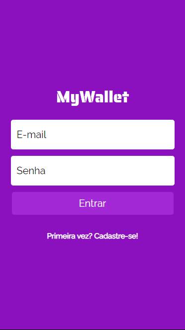
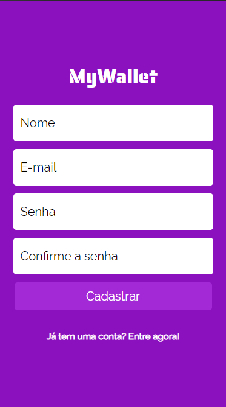
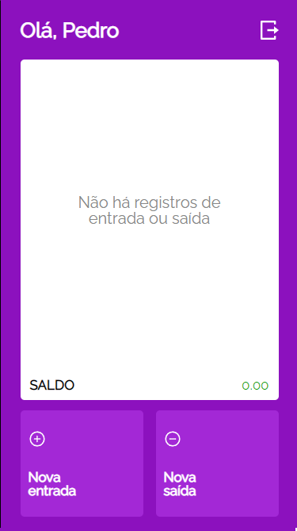
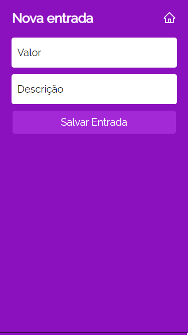
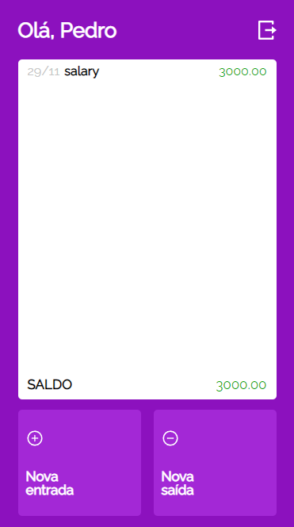

<h1 align="center"> </h1>

# Description
My wallet is a mobile only aplication that is made to save your transactions, in this app you are able to create an account and login to see all your input and output transactions, with a total balace. 

# Layout

 
 
 
 
 

 Figma file <a href="https://www.figma.com/file/p37uJdpZWRLED7YEwDFfUd/MyWallet">here</a>
---

# Getting started

## Running on [vercel](https://projeto14-mywallet-front.vercel.app)

This project needs backend running to work,
to run the backend, follow the instructions on [projeto14-mywallet-back](https://github.com/pedrohotz/projeto14-mywallet-back)

The following tools were used in the construction of the project:

**Frontend**  ([React](https://reactjs.org/))

-   **[Axios](https://github.com/axios/axios)**
-   **[Dayjs](https://github.com/iamkun/dayjs)**
-   **[React-icons](https://github.com/react-icons/react-icons)**
-   **[React-router-dom](https://github.com/remix-run/react-router)**
-   **[React-loader-spinner](https://www.npmjs.com/package/react-loader-spinner)**
-   **[Styled-components](https://github.com/styled-components/styled-components)**
-   **[SweetAlert2](https://github.com/sweetalert2/sweetalert2)**

---
## How to contribute

1. Fork the project.
2. Create a new branch with your changes: `git checkout -b feat/myFeatureName`
3. For each feature implemented, make a commit specifying what was done
4. Submit your changes: `git push -u origin feat/myFeatureName`

---
## Author

Developed by Pedro Hotz Bronzato.